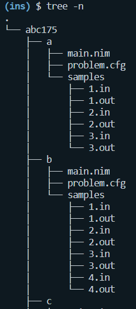
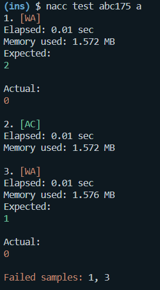

# nacc

A Nim AtCoder command line tool.  
Only tested on Windows Subsystem for Linux.  
Feel free to open an issue.


## Features

- Create a directory for AtCoder contest
    - Download sample cases
- Test your code


## Installation

```sh
nimble install https://github.com/Foo-x/nacc
```


## Usage

```sh
# create a directory for the contest and download sample cases
nacc new abc175
```



The login prompt is displayed for the first time.  
If successful, the session will be saved to `~/.nacc_session` and reused from the next time.

```sh
# test your code
nacc test abc175 a
```



The elapsed time and used memory are measured by GNU time. (`/usr/bin/time`)  
The compiled binary is placed in temporary dir created by `mktemp`.
